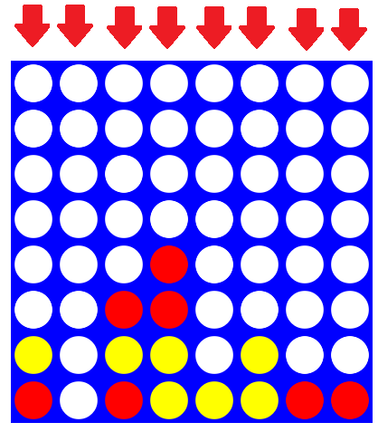

# COMP2026/COMP2045 Programming Assignment 1 - Connect4

## 2022-23 Semester 1

* Designed by: [Dr. Kevin Wang](mailto:kevinw@comp.hkbu.edu.hk)
* Q & A: [Piazza](https://piazza.com/)
* Assignment Website: [GitHub](https://github.com/khwang0/COMP2026-2223PA1)
* Due: 
  * UAT Due: 11:59am (Monday noon), TBD
  * Programming Due: 23:59pm (Saturday midnight), TBD 
* Download the starter code: [Connect4.java](Connect4.java) 
* Download the demo program: [here](demo.jar)
* Download everything from the assignment: [here](https://github.com/khwang0/COMP2026-2223PA1/archive/refs/heads/master.zip)

> To run the demo program, type the following in your terminal:
> 
> ```sh
> > java -jar demo.jar
> ```


# Learning outcome

Students are expected to have some practice on arrays/2D arrays/parameter passing/method construction and usage in this assignment. We expect most students would spend six hours or more to finish the assignment without any assistance. Make sure you start earlier as possible and ask us on Piazza if you have any difficulty!


# Introduction

You are going to complete the Connect4 program! Open [Connect4.java](Connect4.java) and complete the methods stated in the skeleton code. Some of these methods are very straightforward while some of them ain't that easy. Make sure you can follow the instructions given at the top of each method.

A [sample program](demo.jar) is given to you. When there is something you are not sure, you can take a look at the sample program to decide what to do.

Some methods are labeled as completed or given. Please don't make any change on those methods. You are not supposed to modify them.

# Explanation of the game Connect4



<sub><sup>image ref: https://www.101computing.net/connect4-challenge/</sup></sub>

You can skip this section if you have some experience in playing the game Connect4!. It is a grid of 6x8 gameboard where players take turn to drop their block into one of these columns. Their block will reach the bottom by gravity. Whoever player first reaches a line of consecutive four blocks of his/her own symbol wins. The game ends with "draw" if all the holes are filled and no one wins.


# Explanation about the assignment

You are given the skeleton code [Connect4.java](Connect4.java). Complete all methods in the assignment with respect to the instructions stated in the Java file.


# Understanding the Assignment Test (UAT)

This part is independent to your programming code. You will need to answer the following short questions by **another due date**.
Submit your answers on Moodle. 

1. Which method is responsible to print the game board?
2. Which method is responsible to decide if the game ends?
3. Will a player lose his/her turn if he/she decides to change his/her symbol?
4. What key should I press if I decide to restart the game?


---

## Programming Style and Documentation 

Good programming style (indentation, comments) are always essential.  Blank lines, spaces between operators/variables (wherever appropriate) and meaningful variable names are required. Your program should be properly indented.  Good choice of variable names and method names is also essential.  Your program must have proper internal documentation.
Wherever necessary and appropriate, you should add inline comments to explain the execution flow of your program. You are required to remove the word TODO from your program before submission. Fail to do so will yield certain penalty.


# Submission 
For submission upload the file `Connect4.java` to Moodle.  

Please be reminded that both the **Late Penalty Rule** and the **Penalty for Plagiarism** are applied strictly to all submissions of this course (including this assignment).   

### Late Penalty Rule

```java
if (lateHour > 0) {
    if (lateHour < 24) 
        mark *= 0.8;
    else if (lateHour < 48)
        mark = mark >> 1;
        else if (lateHour < 72)
            mark = mark >> 2;
            else
                mark &= 0;
}
```


 ## Plagiarism

 Plagiarism is a serious offense and can be easily detected. Please don't share your code to your classmate even if they are threatening you with your friendship. If they don't have the ability to work on something that can compile, they would not be able to change your code to a state that we can't detect the act of plagiarism. For the first commit of plagiarism, regardless you shared your code or copied code from others, you will receive 0 with an addition of 5-mark penalty. If you commit plagiarism twice, your case will be presented in the exam board and you will receive a F directly.

## Marking Scheme 
This assignment is worth X% of the course mark.  There are three elements in the marking scheme: 
* 5% - Understanding the Assignment Test (UAT)
* 90% - a working program that functions as specified 
* 5% - Programming style and documentation 
* -50% - if you define any class variable (field), addition class, or change the method `main`.

Please note that submitting a program that cannot be compiled would result in a very low mark. 

 

## Interview 
Should the teaching team see fit, students may be requested to attend an interview to explain about their program.  Students failing to attend such interview or to demonstrate a good understanding of their own program may result in mark deduction. 


